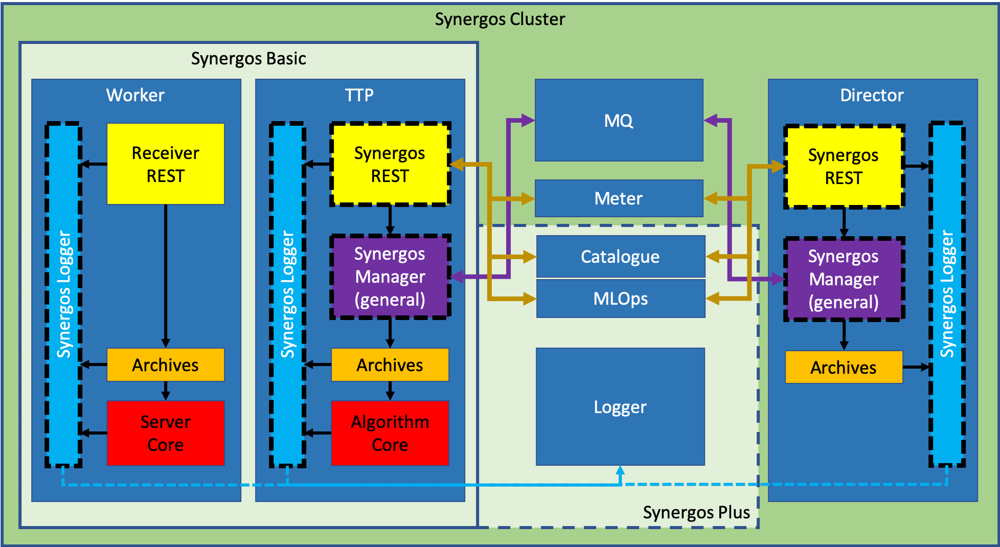
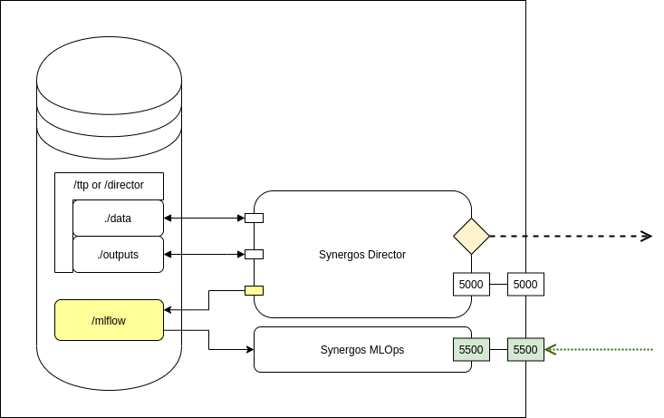

# Synergos MLOps

Analytics component for model & result management in the Synergos network

*Component repositories of Synergos [V3]*

The Synergos grid prides itself on its modular system of deployment, comprizing various deployment combinations as seen from the diagram above. General configurations are as follows:
1. **`Synergos Basic`** 
    > Simplest deployment pattern, consisting a duet of 2 containers - *Synergos-TTP* & *Synergos-Worker*. 
2. **`Synergos Plus`**
    > Intermediate deployment pattern that equips the grid with the capability to for metadata extraction/analysis. This allows users to gain access to hardware statistics, data-cataloguing, lineage tracking and general centrialised logging.
3. **`Synergos Cluster`**
    > Full distributed deployment pattern with job queue integration in addition to metadata extraction. This configuration is optimized for running concurrent federated cycles to facilitate hyperparameter tuning.

By having users install different components depending on their supposed role within the federated grid, most of the complexity associated with federated orchestrations are obscured completely from the users. Specifically, the goal is to stitch entire containers together with unique Dockerfile configurations.

This repository governs **Synergos MLOps** (i.e. ML Operations), the primary analytics component for monitoring & managing federated outputs for the Synergos grid.

---

## Installation
Synergos MLOps is leveraged upon MLFlow, a renown giant in the machine learning space for its model management tools, with the internal REST module directly calibrated to log to this containerized instance of MLFlow.

---

## How to use?
The tracking UI serves an easy way for orchestrators to easily access & download their files/outputs/artifacts from Synergos TTP or Synergos Director deployments.

*Deployment restrictions of Synergos MLOps*


However, as seen from the diagram above, there are certain limitations when deploying the MLOps/MLFlow container. We need to make sure that the Synergos MLOps container MUST always be mounted to the same logging directory/volume as that of the orchestrating containers (i.e. Synergos TTP or Synergos Director). 

Starting the tracking UI is simple: 

```
# Build customised message exhange as a container
docker build -t synergos_mlops:mlflow --label "synmlops_mlflow" .

# Run container
docker run --rm 
    -p 5500:5500 
    -v /path/to/mlflow_test/:/mlflow       # <-- IMPT! Same as orchestrator
    -e GUNICORN_CMD_ARGS="--bind=0.0.0.0"  # <-- IMPT! Makes it accessible
    --name synmlops 
    synergos_mlops:mlflow
```

Once deployed, simply navigate to "`{protocol}`://`{IP address}`:`{port}`" on your web browser.
    
- `Protocol` - Depends if your deployment has have TLS support (i.e. `HTTP` or `HTTPS`)
- `IP address` - IP address of your machine/VM
- `Port` - Port at which the container is deployed to


For instance, if the aforementioned command was ran locally, you can access it via "`http://localhost:5500`".

In context, if deployed correctly, you should see this at the command station in Synergos Portal.

*Integration of Synergos MLOps in Command Station*

You would be able to view all runs that have been completed under the current experiment hierarchy.

*Hyperparameters logged in Synergos MLOps in Command Station*

Entering your run of interest, you should be able to see your Synergos-registered hyperparameters.

*Metrics logged in Synergos MLOps in Command Station*

All Synergos supported metrics will be reflected here as well, and if you select a particular metrics, you should be able to see a round/epoch-level analysis of its progression throughout training.

*Artifacts logged in Synergos MLOps in Command Station*

Lastly, you would be able to view & download all your training artifacts (eg. model weights, round/epoch-level losses) in the `Artifacts` section.